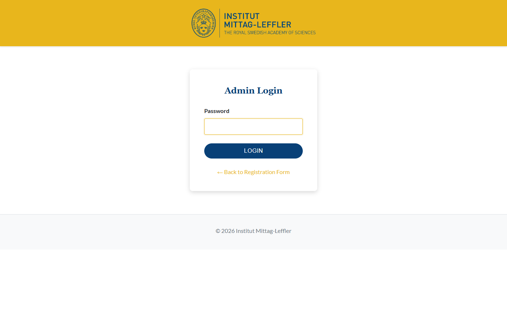
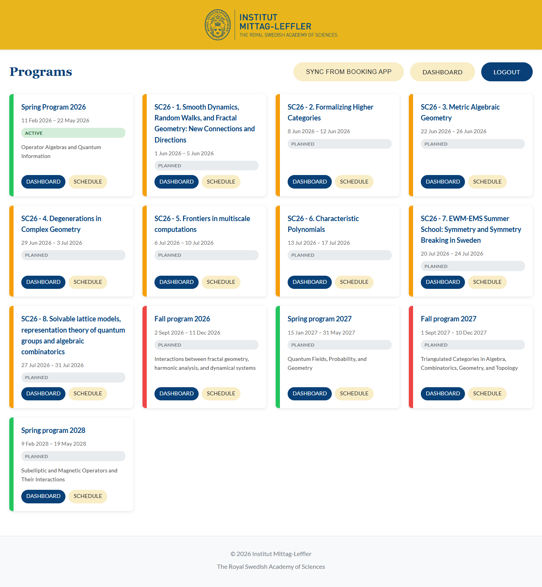
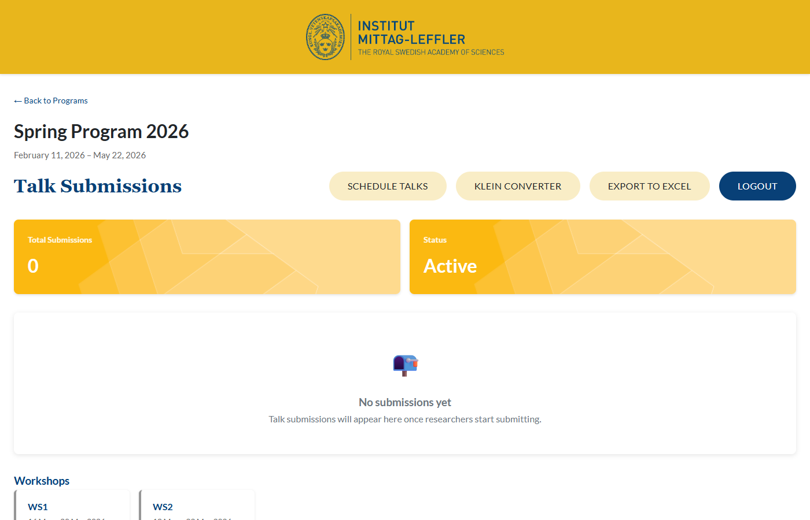
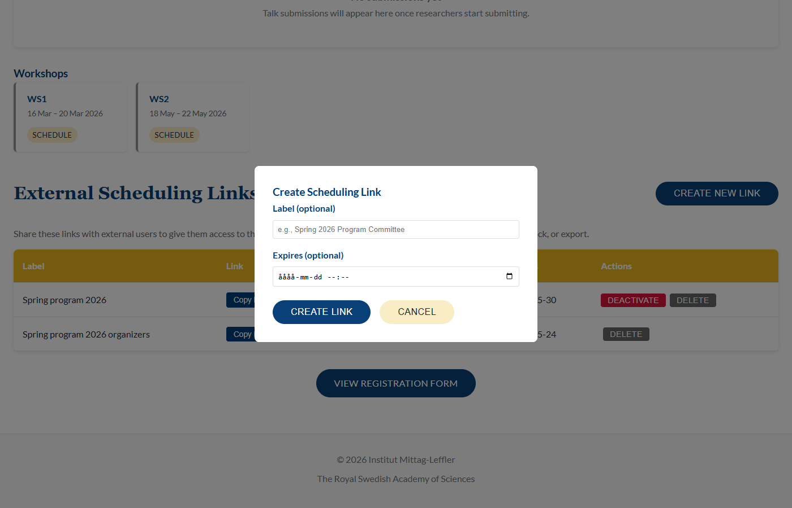
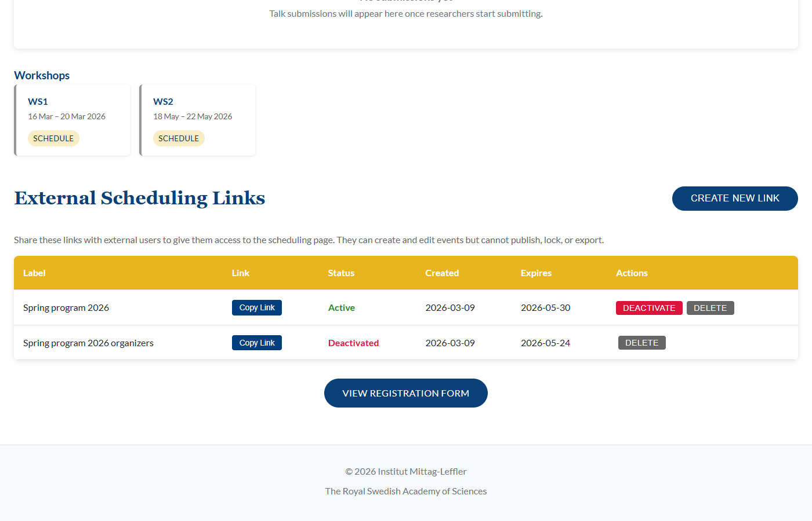

# IML Seminars — Administratörsmanual

## Innehåll

1. [Inloggning](#1-inloggning)
2. [Program](#2-program)
3. [Dela schemaläggning med organisatörer (Magic Links)](#3-dela-schemaläggning-med-organisatörer)
4. [Inskickade föredrag (Submissions)](#4-inskickade-föredrag)
5. [Schemaläggning](#5-schemaläggning)
6. [Block och pauser](#6-block-och-pauser)
7. [Publicering](#7-publicering)
8. [Export](#8-export)
9. [Låsning av schema](#9-låsning-av-schema)
10. [Workshops](#10-workshops)
11. [Behörigheter — Admin vs Organisatör](#11-behörigheter)

---

## 1. Inloggning

Gå till `/admin/login` och logga in med adminlösenordet. Du får då full tillgång till alla funktioner.

Organisatörer loggar inte in med lösenord — de får en delad länk (se avsnitt 3).

---

## 2. Program

### Översikt

Sidan **Programs** (`/admin/programs`) visar alla forskningsprogram. Varje program visas som ett kort med:

- Programnamn
- Datumperiod
- Status: **PLANNED**, **ACTIVE**, **COMPLETED** eller **ARCHIVED**

Avslutade och arkiverade program döljs automatiskt.

### Synkronisera program

Program importeras från IML Booking App:

1. Klicka på **"Sync from Booking App"**
2. Systemet hämtar alla program och workshops
3. Sidan uppdateras med nya/uppdaterade program

> Program skapas inte manuellt — de synkas alltid från bokningsappen.

### Öppna ett program

Klicka på ett programkort för att komma till programmets **Dashboard**. Därifrån kan du:

- Se inskickade föredrag
- Öppna schemaläggaren
- Hantera delningslänkar
- Exportera data

---

## 3. Dela schemaläggning med organisatörer

Externa organisatörer (t.ex. programkommittéer) kan få tillgång till schemaläggningen utan att ha adminlösenordet. Detta görs via **magic links**.

### Skapa en delningslänk

1. Gå till programmets **Dashboard**
2. Scrolla ner till **"External Scheduling Links"**
3. Klicka **"Create New Link"**
4. Fyll i:
   - **Label** (valfritt) — t.ex. "Programkommitté VT2026"
   - **Expires** (valfritt) — datum då länken slutar fungera
5. Klicka **"Create Link"**
6. Klicka **"Copy Link"** för att kopiera URL:en
7. Skicka länken till organisatören via e-post

### Vad organisatören kan göra

Med länken kan organisatören:

- Se schemat för programmet
- Lägga till, flytta och redigera föredrag och events
- Ta bort olåsta poster

Organisatören kan **inte**:

- Se inskickade föredrag (submissions)
- Publicera föredrag till webbplatsen
- Låsa/låsa upp poster
- Exportera schema eller data
- Hantera delningslänkar
- Se andra program

### Hantera länkar

I tabellen under "External Scheduling Links" ser du alla skapade länkar med:

| Kolumn | Beskrivning |
|--------|-------------|
| Label | Valfri beskrivning |
| Link | Kopierbar URL |
| Status | Active / Deactivated / Expired |
| Created | Skapandedatum |
| Expires | Utgångsdatum (eller "Never") |
| Actions | Avaktivera / Ta bort |

### Avaktivera en länk

1. Klicka **"Deactivate"** på raden
2. Bekräfta
3. Länken slutar fungera omedelbart

### Ta bort en länk

Klicka **"Delete"** för att permanent ta bort en länk.

---

## 4. Inskickade föredrag

Programmets Dashboard visar en tabell med alla inskickade föredrag (submissions). Varje rad visar:

- Namn, e-post, tillhörighet
- Föredragstitel
- Datum för inskickning

**Åtgärder:**
- **View** — Visa alla detaljer (abstract, frågor m.m.)
- **Delete** — Ta bort inskickning (kräver bekräftelse)

### Exportera inskickningar

Klicka **"Export to Excel"** på Dashboard-sidan för att ladda ner en Excel-fil med alla inskickningar.

---

## 5. Schemaläggning

### Öppna schemaläggaren

Från programmets Dashboard, klicka **"Schedule Talks"** för att öppna schemaläggningsvyn.

### Layout

Schemasidan har tre delar:

1. **Vänster panel** — Tre flikar:
   - **Unscheduled** — Ej schemalagda föredrag
   - **Add Event** — Skapa egna events
   - **Add Block** — Skapa tidsblock
2. **Mitten** — Kalendervy (dag/vecka)
3. **Höger** — Detaljer vid redigering

### Schemalägg ett föredrag

1. I vänsterpanelen, se listan med ej schemalagda föredrag
2. **Dra** ett föredrag till önskad tid och rum i kalendern
3. En ruta öppnas — bekräfta rum, tid och eventuella anteckningar
4. Klicka **"Save"**
5. Systemet kontrollerar automatiskt om det finns konflikter (dubbelbokning av rum)

### Skapa ett eget event

Använd detta för events som inte kommer från en inskickning (t.ex. "Opening Ceremony", "Panel Discussion"):

1. Klicka fliken **"Add Event"**
2. Klicka **"+ New Event"**
3. Fyll i:
   - **Event Title** (obligatoriskt)
   - **Speaker** (valfritt)
   - **Affiliation** (valfritt)
   - **Description** (valfritt)
   - **Room**, **Start Time**, **End Time**
   - **Publish to Website** (checkbox)
4. Klicka **"Add Event"**

### Redigera ett schemalagt föredrag

1. Klicka på föredraget i kalendern
2. Ändra tid, rum, anteckningar m.m.
3. Klicka **"Save"**

> Låsta poster kan inte redigeras — admin måste låsa upp dem först.

### Ta bort ett schemalagt föredrag

Hovra över posten och klicka det röda **X**-knappen. Bekräfta borttagning.

### Konfliktkontroll

Systemet varnar om du försöker boka ett rum som redan är upptaget under den angivna tiden. Du får en lista på vilka poster som krockar.

---

## 6. Block och pauser

Block används för återkommande saker som fikapauser, luncher eller keynote-sessioner.

### Skapa ett block

1. Klicka fliken **"Add Block"**
2. Klicka **"+ New Block"**
3. Fyll i:
   - **Block Title** (t.ex. "Fika")
   - **Room** (valfritt)
   - **Start Time** och **End Time**
   - **Lock by default** (rekommenderas — förhindrar oavsiktlig redigering)
4. Klicka **"Save Block"**

### Upprepande block

Om blocket ska upprepas (t.ex. fika varje vardag):

1. Under **Repeat Options**, välj mönster:
   - **Daily** — varje dag
   - **Weekdays** — måndag–fredag
   - **Weekly** — en gång per vecka
   - **Custom** — välj specifika veckodagar
2. Sätt **Until**-datum (sista dagen för upprepning)
3. Spara — systemet skapar automatiskt alla instanser

Upprepande block markeras med en **"REPEAT"**-badge.

### Redigera upprepande block

- **Enskild instans:** Klicka och redigera som vanligt
- **Hela serien:** Systemet frågar om du vill uppdatera alla instanser eller bara den valda

### Ta bort upprepande block

Vid borttagning frågar systemet om du vill ta bort hela serien eller bara den enskilda instansen.

---

## 7. Publicering

Publicering styr vilka föredrag som syns på webbplatsen och i eventappen.

### Publicera enskilt föredrag

1. Hovra över ett schemalagt föredrag i kalendern
2. Klicka **"Mark as Published"**
3. Posten får en guldmarkering och "Published"-badge

### Avpublicera

Klicka **"Unpublish"** på en redan publicerad post.

### Batch-publicering

För att publicera flera föredrag samtidigt:

1. Kryssa i checkboxar på de föredrag du vill publicera
2. Använd **"Select All"** för att markera alla synliga
3. Klicka **"Publish Selected"**

### Publish to Website-checkbox

Vid redigering av ett föredrag/event finns checkboxen **"Publish to Website"**. Denna styr om posten får taggen "website" i app-exporten.

> Endast admin kan publicera — organisatörer (via magic link) har inte denna möjlighet.

---

## 8. Export

Två exportformat finns, tillgängliga via knappar högst upp på schemasidan:

### Export to Excel

- Laddar ner en Excel-fil med **alla** schemalagda poster
- Kolumner: Start, End, Speaker, Title, Affiliation, Abstract, Room, Tag
- Användning: Intern planering, webbplatspublicering

### Export for App (Ventla)

- Laddar ner en Excel-fil med **enbart publicerade** poster
- Format anpassat för import i Ventla eventapp
- Kolumner: Start date, Start time, End date, End time, Title, Description, Track, Tags, Room, Groups
- Taggen "website" läggs till för poster med "Publish to Website" ikryssat

> Exportfunktioner är enbart tillgängliga för admin.

---

## 9. Låsning av schema

Låsning förhindrar att poster ändras av misstag.

### Låsa en post

1. Hovra över posten
2. Klicka hänglåsikonen (🔓 → 🔒)

### Effekt av låsning

- Posten kan **inte** redigeras (tid, rum, detaljer)
- Posten kan **inte** tas bort
- Posten kan fortfarande publiceras/avpubliceras av admin

### Låsa upp

Klicka på hänglåsikonen igen för att låsa upp.

> Endast admin kan låsa/låsa upp. Organisatörer kan inte ändra låsta poster.

---

## 10. Workshops

Vissa program har workshops (delprogram). Dessa visas på programmets Dashboard.

### Schemalägg en workshop

1. Klicka **"Schedule"** på workshop-kortet
2. Du kommer till en schemaläggningsvy som är identisk med programmets, men avgränsad till workshopen
3. Alla funktioner (events, block, publicering, export) fungerar likadant

### Workshop-specifika magic links

Du kan skapa delningslänkar som ger tillgång till en specifik workshop istället för hela programmet.

---

## 11. Behörigheter

| Funktion | Admin | Organisatör (magic link) |
|----------|:-----:|:------------------------:|
| Se program & synka | ✓ | — |
| Se inskickade föredrag | ✓ | — |
| Ta bort inskickningar | ✓ | — |
| Exportera inskickningar | ✓ | — |
| Se/skapa/redigera schema | ✓ | ✓ |
| Ta bort olåsta poster | ✓ | ✓ |
| Låsa/låsa upp | ✓ | — |
| Publicera/avpublicera | ✓ | — |
| Exportera schema | ✓ | — |
| Exportera för app | ✓ | — |
| Batch-publicering | ✓ | — |
| Skapa delningslänkar | ✓ | — |

---

## Snabbreferens — vanliga arbetsflöden

### Nytt program

1. Synka program från Booking App
2. Öppna programmets Dashboard
3. Skapa delningslänkar vid behov
4. Vänta på inskickade föredrag

### Schemalägg ett program

1. Skapa block för pauser och fasta tider
2. Dra inskickade föredrag till kalendern
3. Skapa egna events för öppning, paneler m.m.
4. Lås klara poster

### Publicera och exportera

1. Markera färdiga föredrag som publicerade
2. Använd batch-publicering för hela dagar
3. Exportera till Excel eller för eventappen
