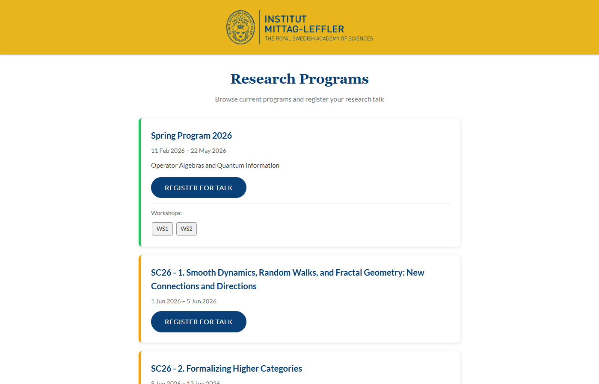
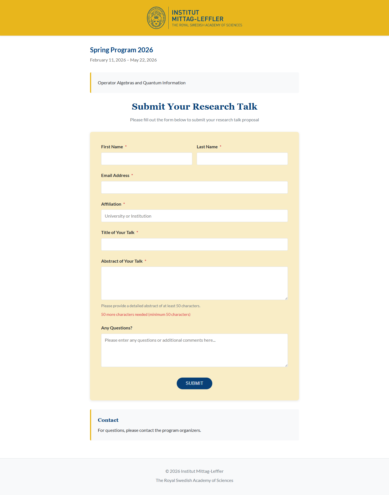
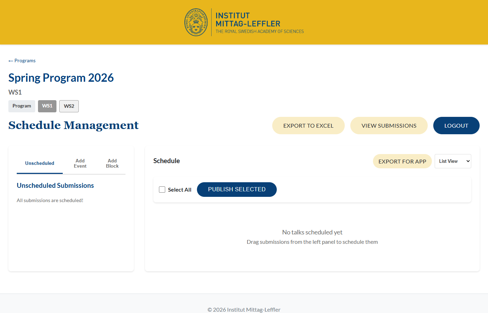
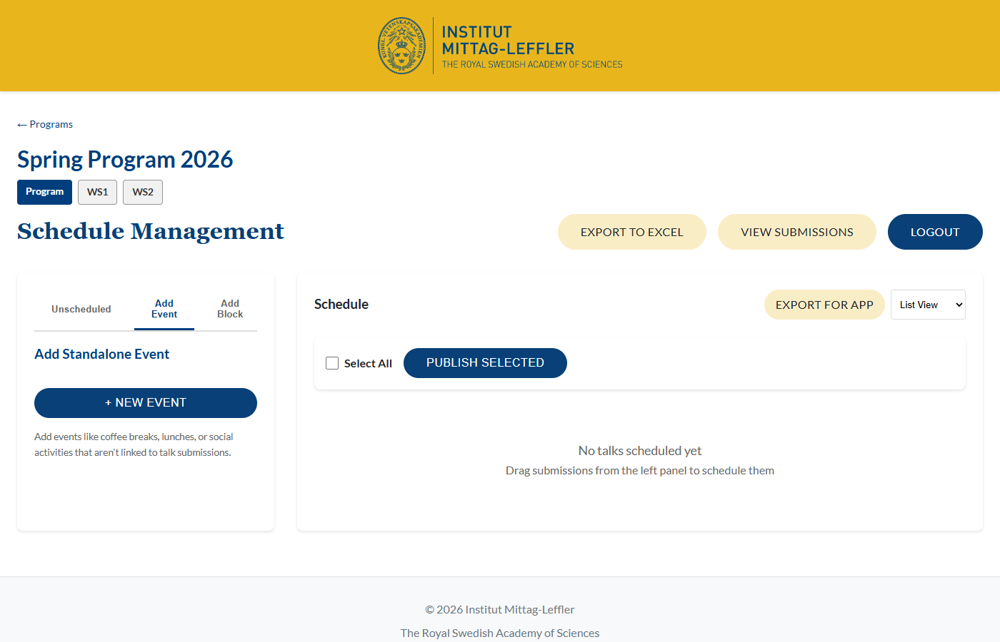
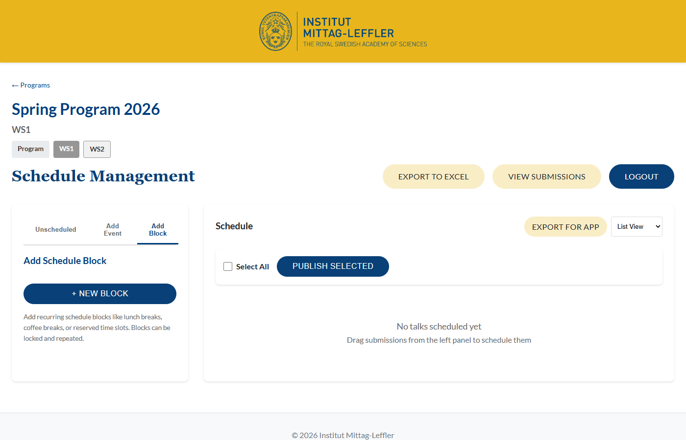

# IML Seminars — Manual för organisatörer

Den här guiden beskriver hur du som extern organisatör använder IML Seminars för att hantera schemaläggning och registrering av forskningsföredrag.

## Innehåll

1. [Komma igång](#1-komma-igång)
2. [Registrering för talare](#2-registrering-för-talare)
3. [Schemaläggning](#3-schemaläggning)
4. [Skapa egna events](#4-skapa-egna-events)
5. [Block och pauser](#5-block-och-pauser)
6. [Redigera och ta bort poster](#6-redigera-och-ta-bort-poster)
7. [Vad du inte kan göra](#7-vad-du-inte-kan-göra)

---

## 1. Komma igång

Du behöver ingen inloggning. IML-administratören delar en **länk** med dig som ger direkt åtkomst till schemaläggningen för ditt program.

Länken ser ut ungefär så här:

```
https://imlseminars.up.railway.app/schedule/abc123def456...
```

Klicka på länken för att öppna schemasidan. Länken kan ha ett utgångsdatum — kontakta administratören om den inte fungerar.

---

## 2. Registrering för talare

Talare registrerar sina föredrag själva via ett publikt formulär. Som organisatör behöver du **dela registreringslänken** med de talare som ska hålla föredrag.

### Programlistan

Talare som besöker webbplatsens startsida ser en lista med alla aktiva forskningsprogram.



Varje program visar:
- Programnamn och datumperiod
- Beskrivning
- Eventuella workshops
- Knappen **"Register for Talk"**

### Registreringsformuläret

När talaren klickar **"Register for Talk"** öppnas registreringsformuläret.



Talaren fyller i:

| Fält | Beskrivning |
|------|-------------|
| **First Name** | Förnamn (obligatoriskt) |
| **Last Name** | Efternamn (obligatoriskt) |
| **Email Address** | E-postadress (obligatoriskt) |
| **Affiliation** | Universitet eller institution (obligatoriskt) |
| **Title of Your Talk** | Föredragstitel (obligatoriskt) |
| **Abstract of Your Talk** | Sammanfattning, minst 50 tecken (obligatoriskt) |
| **Any Questions?** | Valfria frågor eller kommentarer |

Efter att formuläret skickas in visas en bekräftelsesida. Föredraget dyker upp i schemaläggaren under fliken "Unscheduled".

### Dela registreringslänken

Du kan dela direktlänken till registrering för ditt program. Formatet är:

```
https://imlseminars.up.railway.app/p/{program-id}/register
```

Be administratören om den exakta länken, eller hitta den via programmets "View Registration Form"-knapp.

Om programmet har **workshops** kan talare registrera sig till en specifik workshop via:

```
https://imlseminars.up.railway.app/p/{program-id}/ws/{workshop-id}/register
```

---

## 3. Schemaläggning

### Översikt

När du öppnar din schemalänk ser du schemaläggningssidan.



Sidan har två huvuddelar:

1. **Vänster panel** — Tre flikar:
   - **Unscheduled** — Inskickade föredrag som ännu inte har en tid
   - **Add Event** — Skapa egna events
   - **Add Block** — Skapa tidsblock (pauser m.m.)
2. **Schema** — Visar alla schemalagda poster i list- eller kalendervy

### Schemalägg ett föredrag

1. Klicka fliken **"Unscheduled"** i vänsterpanelen
2. Du ser en lista med inskickade föredrag
3. **Dra** ett föredrag till önskad tid i schemat, eller klicka på det
4. Välj **rum**, **starttid** och **sluttid**
5. Klicka **"Save"**

Systemet kontrollerar automatiskt om det finns **konflikter** — du kan inte dubbelbooka ett rum.

### Byta vy

Överst till höger kan du växla mellan **List View** och kalendervy.

---

## 4. Skapa egna events

Ibland behöver du lägga till poster som inte kommer från en inskickning, t.ex. "Opening Ceremony", "Panel Discussion" eller "Social Dinner".



1. Klicka fliken **"Add Event"** i vänsterpanelen
2. Klicka **"+ New Event"**
3. Fyll i:
   - **Event Title** (obligatoriskt)
   - **Speaker** (valfritt)
   - **Affiliation** (valfritt)
   - **Description** (valfritt)
   - **Room**, **Start Time**, **End Time**
4. Klicka **"Add Event"**

Eventet visas direkt i schemat.

---

## 5. Block och pauser

Block används för återkommande poster som fikapauser, luncher eller gemensamma sessioner.



### Skapa ett block

1. Klicka fliken **"Add Block"** i vänsterpanelen
2. Klicka **"+ New Block"**
3. Fyll i:
   - **Block Title** (t.ex. "Coffee Break")
   - **Room** (valfritt)
   - **Start Time** och **End Time**
4. Klicka **"Save Block"**

### Upprepande block

Om blocket ska återkomma varje dag (t.ex. fika kl 10:30 varje vardag):

1. Under **Repeat Options**, välj mönster:
   - **Daily** — varje dag
   - **Weekdays** — måndag–fredag
   - **Weekly** — en gång per vecka
   - **Custom** — välj specifika veckodagar
2. Sätt **Until**-datum (sista dagen)
3. Spara — systemet skapar alla instanser automatiskt

---

## 6. Redigera och ta bort poster

### Redigera

1. Klicka på en post i schemat
2. Ändra tid, rum eller andra detaljer
3. Klicka **"Save"**

### Ta bort

1. Hovra över posten
2. Klicka det röda **X**
3. Bekräfta borttagning

> **Obs:** Poster som administratören har **låst** (markerade med ett hänglås) kan inte redigeras eller tas bort. Kontakta administratören om du behöver ändra en låst post.

### Upprepande block

Vid borttagning av ett upprepande block frågar systemet om du vill ta bort:
- **Bara denna instans** — tar bort en enskild dag
- **Hela serien** — tar bort alla instanser

---

## 7. Vad du inte kan göra

Som organisatör (via delad länk) har du **inte** tillgång till:

| Funktion | Tillgänglig? |
|----------|:------------:|
| Se/redigera schemat | Ja |
| Skapa events och block | Ja |
| Ta bort olåsta poster | Ja |
| Se inskickade föredrag (detaljer) | Ja |
| Publicera föredrag till webbplatsen | Nej |
| Låsa/låsa upp poster | Nej |
| Exportera schema (Excel) | Nej |
| Exportera för eventapp | Nej |

Kontakta IML-administratören om du behöver hjälp med publicering, export eller andra adminfunktioner.

---

## Snabbreferens

### Schemalägg ett helt program

1. Börja med att skapa **block** för fasta tider (fika, lunch)
2. Använd upprepande block för hela veckor
3. Dra inskickade föredrag från "Unscheduled" till schemat
4. Skapa egna events för öppning, paneler, sociala aktiviteter
5. Meddela administratören när schemat är klart för publicering

### Tips

- Systemet förhindrar dubbelbokning av rum — om du får en konfliktvarning, välj en annan tid eller ett annat rum
- Låsta poster (med hänglåsikon) är skyddade — kontakta admin för ändringar
- Workshops har egna schemaläggningssidor, åtkomliga via flikarna högst upp
